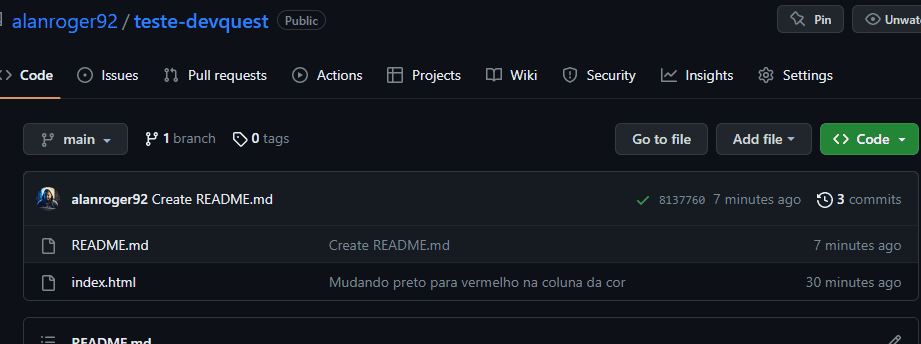

# Readme: Tabelas Criadas com HTML
Este é um simples Readme para explicar como criar tabelas utilizando HTML. As tabelas são elementos bastante úteis para exibir dados organizados e estruturados em uma página da web. O HTML fornece tags específicas para criar tabelas de forma simples e flexível.

